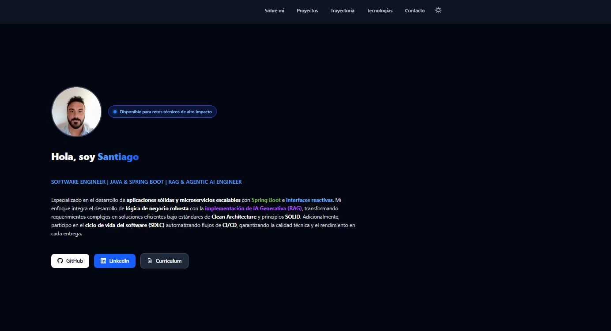

# Engineering Portfolio & RAG

Software engineering portfolio with an integrated conversational assistant based on RAG (*Retrieval-Augmented Generation*). The chat retrieves semantic chunks from the portfolio knowledge base stored in a vector database and injects them as context into the LLM prompt, returning accurate and grounded responses.



## Stack

| Layer | Technology |
| :--- | :--- |
| Framework | Astro 5.0 (SSR) |
| Interactive UI | Preact + Island Architecture |
| Styles | Tailwind CSS v4 |
| LLM | Groq (via AI SDK) |
| Embeddings | OpenAI-compatible API (e.g. HuggingFace) |
| Vector database | Milvus (Zilliz) |
| Deployment | Vercel |
| Language | TypeScript |

## Architecture

The chat follows the standard RAG pattern:

```
User → API /api/chat
              ↓
        Generate query embedding
              ↓
        Semantic search in Milvus (HNSW + cosine)
              ↓
        Inject retrieved chunks into the system prompt
              ↓
        Groq inference → streamed response
```

The codebase is organized by responsibility, not by file type:

```
src/
├── components/         # UI components (Astro + Preact)
│   ├── layout/         # Navbar, Footer
│   ├── sections/       # Page sections (Hero, Projects, About…)
│   └── ui/             # Interactive components (ChatWindow, ThemeToggle)
├── content/            # Typed content collections (projects, technologies…)
├── data/               # Portfolio knowledge base (seeding source of truth)
├── hooks/              # Preact custom hooks
├── lib/
│   ├── ai/             # RAG logic: embeddings, Milvus client, search, prompt
│   ├── security/       # IP-based rate limiter
│   └── ui/             # Chat UI constants
└── pages/
    ├── index.astro     # Main page
    └── api/chat.ts     # Chat streaming endpoint
scripts/
├── init-vector-db.ts   # Creates the Milvus collection and HNSW index
└── seed-vector-db.ts   # Embeds the knowledge base and inserts into Milvus
```

## Prerequisites

- Node.js 20+
- A Milvus instance or account on [Zilliz Cloud](https://cloud.zilliz.com)
- [Groq](https://console.groq.com) API key
- An OpenAI-compatible embeddings endpoint (e.g. HuggingFace Inference Endpoints)

## Setup

### 1. Install dependencies

```bash
npm install
```

### 2. Environment variables

```bash
cp .env.example .env
```

Fill in the values in `.env`. The `.env.example` file includes reference URLs and the expected format for each key.

### 3. Initialize the vector database

Run these two scripts in order. This only needs to be done once (or whenever the knowledge base changes).

```bash
# Creates the Milvus collection and HNSW index
npm run db:setup

# Embeds the knowledge base and inserts the chunks
npm run db:seed
```

### 4. Start the development server

```bash
npm run dev
# → http://localhost:4321
```

## Commands

| Command | Description |
| :--- | :--- |
| `npm run dev` | Development server at `localhost:4321` |
| `npm run build` | Production build to `./dist/` |
| `npm run preview` | Preview the build locally before deploying |
| `npm run db:setup` | Initializes the Milvus vector collection |
| `npm run db:seed` | Inserts portfolio embeddings into Milvus |

## Deployment on Vercel

The project uses the official Astro adapter for Vercel. Deployment is automatic once the repository is connected in the Vercel dashboard.

Make sure all environment variables defined in `.env.example` are configured under **Environment Variables** in the Vercel project settings before deploying.

## Security

- **Rate limiting**: the `/api/chat` endpoint is limited to 20 requests per IP every 60 seconds.
- **Environment validation**: Astro validates environment variables at build time via `envField`, preventing startup with incomplete configuration.
- **Prompt hardening**: the system prompt includes explicit instructions to resist prompt injection attempts embedded in user queries.

## License

[MIT](LICENSE)